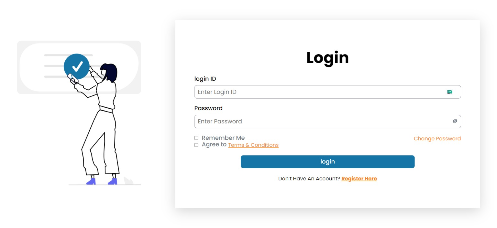

# Vite React Login Form Page

Welcome to the Vite React Login Form Page repository! This project showcases a responsive login form built with Vite, React, styled-components, and powered by form validation using `react-hook-form` along with icons from `react-icons` and toast notifications using `react-hot-toast`.



## Features

- **Responsive Design**: The login form is designed to provide a seamless experience across various devices and screen sizes.
- **Styled Components**: The UI components are styled using `styled-components` for a clean and maintainable codebase.
- **Form Validation**: The form validation is implemented using `react-hook-form` to ensure data accuracy and improve user experience.
- **Icons**: Icons used in the project are sourced from `react-icons`, adding a visual appeal to the user interface.
- **Toast Notifications**: Toast notifications are implemented using `react-hot-toast` to provide real-time feedback to users during form submission and validation.

## Prerequisites

- [Node.js](https://nodejs.org/) installed on your local machine
- Basic knowledge of React, Vite, styled-components, `react-hook-form`, `react-icons`, and `react-hot-toast`

## Getting Started

1. Clone the repository:

   ```bash
   git clone https://github.com/KamalJoshi-web/aimed-labs-login-form.git
   ```

2. Change directory to the project folder:

   ```bash
   cd vite-react-login-form
   ```

3. Install dependencies:

   ```bash
   npm install
   ```

4. Start the development server:

   ```bash
   npm run dev
   ```

   The application will be accessible at `http://localhost:3000`.

## Usage

Feel free to explore the codebase, modify styles, and enhance functionality according to your requirements. Below are some key files and directories in the project:

- **`src/components/LoginForm.js`**: Contains the login form component with form validation logic using `react-hook-form`.
- **`src/styles/GlobalStyles.js`**: Global styles for the application using `styled-components`.
- **`src/App.js`**: Main application component rendering the `LoginForm` component.

## Dependencies

- [React](https://reactjs.org/)
- [Vite](https://vitejs.dev/)
- [styled-components](https://styled-components.com/)
- [react-hook-form](https://react-hook-form.com/)
- [react-icons](https://react-icons.github.io/react-icons/)
- [react-hot-toast](https://react-hot-toast.com/)

## Contributing

Contributions are welcome! Feel free to open issues or submit pull requests to help improve this project.

Happy coding! 😊
